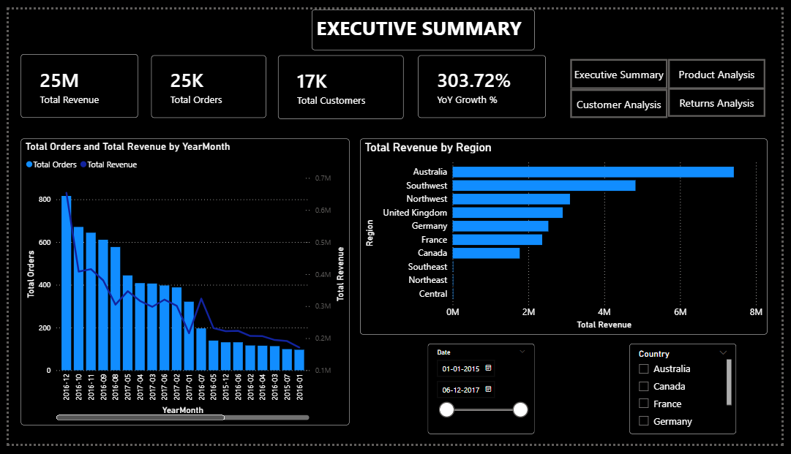
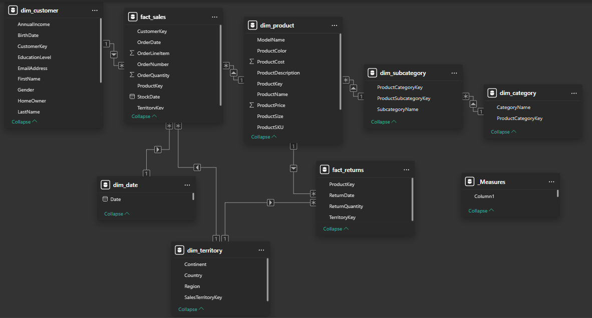
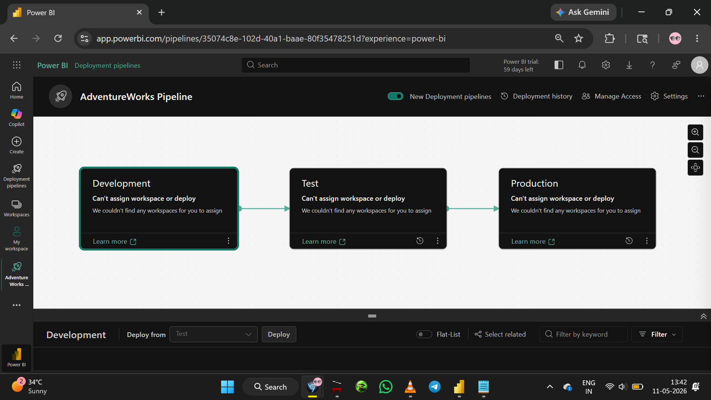

# AdventureWorks BI Pipeline

## Project Overview
End-to-end Power BI business intelligence project built on 
the AdventureWorks retail dataset. Demonstrates enterprise-level 
BI development skills including data modelling, DAX, RLS, and 
deployment pipeline setup.

## Live Report
[View Live Report](https://app.powerbi.com/groups/me/reports/ddf04c11-c174-4ce3-9f39-c1c23dc3f1d0/19531b1ac55a60659edd?experience=power-bi)

## Business Problem
AdventureWorks Cycles needed a centralized BI solution to track:
- Sales performance across regions and products
- Customer behaviour and retention
- Product returns and quality metrics
- Year-over-year growth trends

## Tech Stack
- Power BI Desktop
- Power Query (M language)
- DAX
- Power BI Service
- Deployment Pipelines (Dev → UAT → Prod)

## Data Model
Star schema with 2 fact tables and 6 dimension tables:

**Fact Tables:**
- fact_sales — 25,000+ rows of sales transactions (2015-2017)
- fact_returns — product return records

**Dimension Tables:**
- dim_customer, dim_product, dim_category
- dim_subcategory, dim_territory, dim_date

## DAX Measures
10 measures including:
- Total Revenue, Total Orders, Total Customers
- YoY Growth %, Revenue YTD, Revenue SPLY
- Return Rate, Average Revenue per Order

See [dax/measures.dax](dax/measures.dax) for full code.

## Report Pages
1. Executive Summary — KPI cards, revenue trends, regional breakdown
2. Product Analysis — top products, category performance, matrix
3. Customer Analysis — customer trends by region and time
4. Returns Analysis — return rates by product and category

## Security
Row Level Security (RLS) implemented with country-based roles:
- Australia Sales role
- United States Sales role

## Deployment
Deployment pipeline configured with 3 stages:
- Development → Test (UAT) → Production

## Screenshots

## Dataset
Source: AdventureWorks on Kaggle
https://www.kaggle.com/datasets/khantrack/power-bi-adventure-works-project
